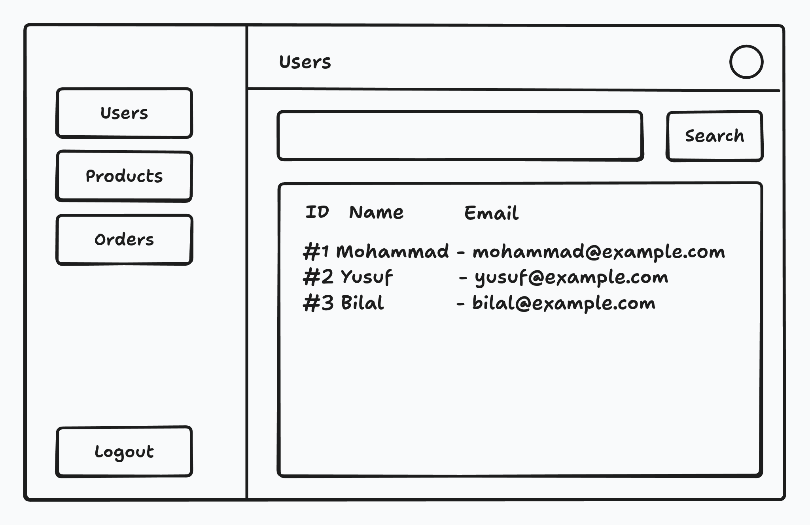

# Exercise: SvelteKit E-Commerce Dashboard

Build a simple dashboard application for an imaginary online shop using **SvelteKit** and **Svelte 5**. The goal is to demonstrate common frontend development tasks, including **form handling**, **error management**, **correct HTML structure**, fundamental **CSS styling**, and **CRUD** (Create, Read, Update, Delete) operations.

---

## Frontend Requirements

The application must manage at least three main entities: **`users`**, **`products`**, and **`orders`**.

For each entity, you must implement the following functionality:

- **Schema**: Add whichever fields make sense for you to the `user`, `product` and `order` objects and their related forms.
- **Filtering:** Allow filtering by relevant fields (e.g., name or email).
- **CRUD Operations:** Provide pages/components to **view details**, **create new** entries, **update existing** objects, and **delete** them.
- **Modals:** You may use modals to manage certain operations for a better user experience.
- **Authentication:** The entire application must be protected by a simple **login form**.

---

## Backend & Data

While the focus is on the frontend, data should be persisted on the server using a data structure of your choice.

**Note:** You **do not** need to implement true authentication and authorization. A simple check of an email and password is sufficient for the login form.

---

## Technical Specifications

- **Frameworks:** Node.js, SvelteKit, Svelte 5.
- **Styling:** Use **plain CSS only**; no CSS or UI libraries are permitted.
- **Constraints:** **No AI** tools are to be used in the development process.
- **Flexibility:** You are free to add any additional features that enhance the user experience.

---

## Submission

There is no fixed timeframe for this exercise. Once completed:

1. Publish the source code to GitHub.
2. Deploy the application to Netlify or a platform of your choice.
3. Send both the GitHub source code link and the live application link to `oguzhan.cinar@cnr-it.de`.
